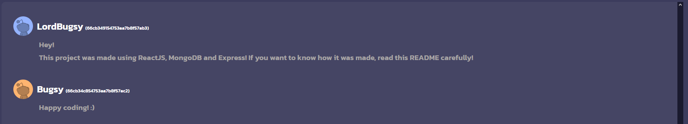

# LiveChat


## Description
**LiveChat** is a real-time chat application built using modern web technologies, including ReactJS for the frontend, MongoDB (Mongoose) for the database, and Express.js for the backend API. This project demonstrates how to create a dynamic, real-time chat interface where users can send and receive messages instantly.

## Installation
First of all, make sure you have [Node.js](https://nodejs.org/en/download/package-manager) installed and a [MongoDB URI](https://www.mongodb.com/docs/manual/reference/connection-string/)

Then, do the following steps:
```bash
# Clone the git repository
git clone

# Then run the application
npm start

# And lastly, in your browser, enter the url:
http://localhost:5173
```

## Informations
If you have this error in the console:
```bash
MongoParseError: Invalid scheme, expected connection string to start with "mongodb://" or "mongodb+srv://"
```
This means that you didn't enter a valid Mongo URI in your '.env' file. Your Mongo URI must look like this:
```js
MONGO_URI="mongodb+srv://<username>:<password>@cluster0.qk6mh.mongodb.net/?retryWrites=true&w=majority&appName=Cluster0"
// where <username> and <password> are your MongoDB logins (they're given to you when you create an account).
```

## License
This project is open source and available under the [MIT Licence](./Licence.txt).

## Miscellaneous
If you encounter any issues while using this app, please contact me asap:
[@LordBugsy](https://github.com/LordBugsy)
[@mylordbugsy](https://twitter.com/mylordbugsy)